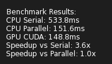
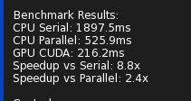
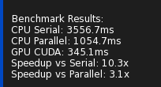
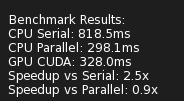
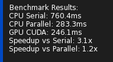
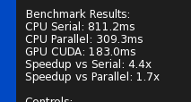
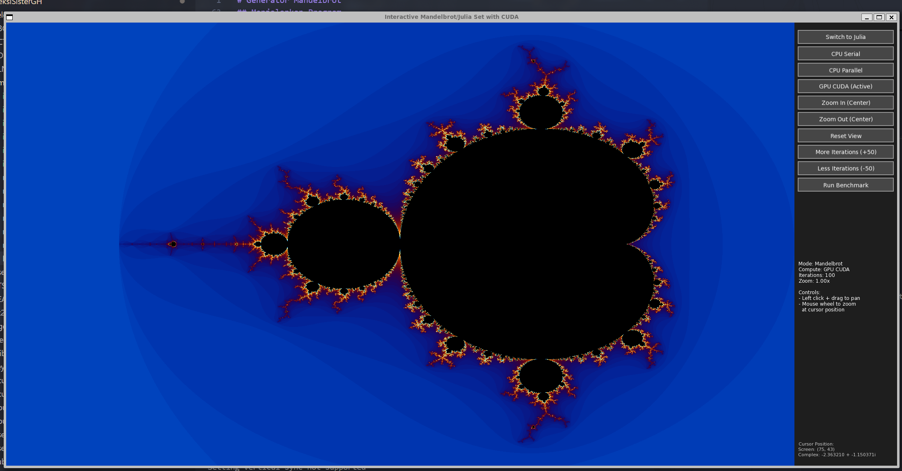
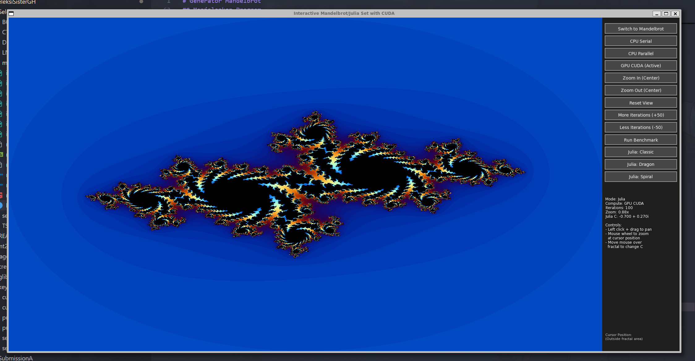

# Generator Mandelbrot

Kumpulan generator fraktal himpunan Mandelbrot dan Julia dengan implementasi serial dan paralel.

## File

- `main-serial.cpp` - Implementasi serial yang menghasilkan gambar himpunan Mandelbrot dan menyimpannya sebagai file BMP
- `main-parallel.cpp` - Implementasi paralel interaktif dengan GUI yang menampilkan himpunan Mandelbrot dan Julia
- `main-cuda.cu` - Implementasi paralel interaktif dengan GUI yang menampilkan himpunan Mandelbrot dan Julia dikembangkan dengan CUDA

## Penjelasan Implementasi

### Implementasi Serial
Program sederhana yang menghitung himpunan Mandelbrot secara berurutan menggunakan satu thread. Program meminta input dimensi gambar, kemudian menghasilkan fraktal dan menyimpannya sebagai file BMP. 

### Implementasi Paralel
Program interaktif dengan antarmuka grafis menggunakan SFML yang menampilkan fraktal secara real-time. Fitur yang tersedia:
- Rendering multi-thread untuk performa optimal
- Mode Mandelbrot dan Julia set yang dapat beralih
- Kontrol zoom dan pan dengan mouse
- Pengaturan iterasi dinamis
- Tampilan informasi real-time (koordinat, zoom level, dll)
- Kontrol GUI untuk navigasi dan pengaturan


### Implementasi Cuda
Program interaktif dengan antarmuka grafis menggunakan SFML yang menampilkan fraktal secara real-time. Merupakan lanjutan dri kode paralel yang ditambah dengan cuda dan serial untuk benchmarking 
Fitur yang tersedia:
- Rendering multi-thread untuk performa optimal
- Mode Mandelbrot dan Julia set yang dapat beralih
- Kontrol zoom dan pan dengan mouse
- Pengaturan iterasi dinamis
- Tampilan informasi real-time (koordinat, zoom level, dll)
- Kontrol GUI untuk navigasi dan pengaturan

## Kompilasi

### Versi Serial
```bash
make compile-serial
```
atau
```bash
g++ -o main-serial main-serial.cpp
```

### Versi Paralel/Interaktif
```bash
make compile-parallel
```
atau
```bash
g++ -o main-parallel main-parallel.cpp -lsfml-graphics -lsfml-window -lsfml-system
```

## Kebutuhan

- **Versi serial**: Compiler C++ standar (g++, clang++)
- **Versi paralel**: Library SFML (Simple and Fast Multimedia Library)
  - Ubuntu/Debian: `sudo apt install libsfml-dev`
  - macOS: `brew install sfml`
  - Windows: Unduh dari [website SFML](https://www.sfml-dev.org/download.php)

## Menjalankan Program

### Versi Serial
```bash
./main-serial
```

### Versi Parallel
```bash
./main-parallel
```

### Versi Cuda
```bash
./main-cuda
```


## BenchMark

### Mandelbrot 100 Iteration


### Mandelbrot 500 Iteration


### Mandelbrot 1000 Iteration


### Julia 100 Iteration


### Julia 500 Iteration


### Julia 1000 Iteration


## Gambar Fractal Mendelbrot


## Gambar Fractal Julia (Classic)


## Link Demo
-> https://youtu.be/GleoHxAFg9E